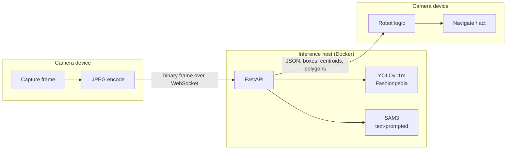
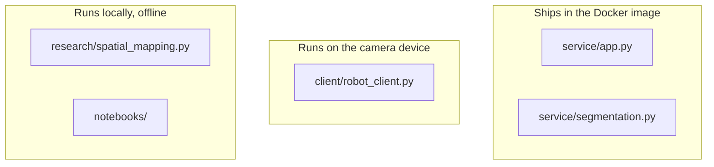

# Robotic Vision

**Real-time clothing detection and segmentation for mobile robots, served as a containerised API.**

A robot that tidies up needs to answer two questions about a garment on the floor: *what
is it*, and *where exactly is it*. This repo answers both, and — importantly — does so on
a machine that is **not** the robot. The camera device streams JPEG frames over a
WebSocket and gets back geometry; all model weights and all inference stay server-side.
That split is what lets hardware too small to host a vision model still use one.

---

## How it works



The client sends one frame, then **waits for that frame's reply before capturing the
next**. Only one frame is ever in flight, so detection lag is bounded by a single round
trip no matter how slow the server is. Sending on a fixed timer instead lets frames queue
whenever inference falls behind, and the delay compounds without limit — which, on a
moving robot, means acting on a picture of where things used to be.

### Two models, two jobs

| | **YOLOv11m** (`/ws/webcam`) | **SAM3** (`/ws/segment`) |
|---|---|---|
| Question | What garment is this? | Which pixels exactly? |
| Output | Bounding boxes + class + confidence | Mask centroid, area, outline polygon |
| Vocabulary | Fixed (Fashionpedia classes) | Open, via text prompts |
| Speed | Real-time on CPU | Slow on CPU — see [Limitations](#limitations) |

Masks matter for navigation. A bounding box drawn around a crumpled shirt has a centre
point that can easily land on bare floor between two sleeves; sampling depth there gives a
distance to the floor, not the garment. `/ws/segment` therefore returns a **mask centroid
computed from image moments**, not a box centre.

SAM3 is far too slow to run per frame, so the segmenter runs it occasionally and tracks
masks between runs with dense optical flow, re-segmenting on a scene change, on a periodic
refresh, or when a tracked mask's area drifts far enough to call tracking lost.

---

## What runs where



| Directory | Purpose | Containerised |
|---|---|---|
| `service/` | FastAPI app + SAM3 segmenter. The deployable unit. | Yes |
| `client/` | Streaming client for the camera device. Needs only OpenCV, NumPy, websockets. | No |
| `research/` | Monocular depth, ORB visual odometry, 3D occupancy grid. Needs Open3D and a display. | No |
| `notebooks/` | Training runs and experiments. | No |

The Dockerfile copies `service/` and nothing else, so the boundary is enforced by the
build rather than by convention.

---

## Quickstart

```bash
git clone https://github.com/Tommytang111/Robotic-Vision.git
cd Robotic-Vision

python -m venv .venv && source .venv/bin/activate
pip install -r requirements.txt --extra-index-url https://download.pytorch.org/whl/cpu

# Weights are not in the repo - see "Model weights" below
mkdir -p models && cp /path/to/yolov11m-fashionpedia.pt models/

python service/app.py                       # http://localhost:8000
```

Then, in a second terminal:

```bash
pip install -r requirements-client.txt
python client/robot_client.py --show                    # YOLO detection
python client/robot_client.py --mode segment --show     # SAM3 segmentation
```

Or just open <http://localhost:8000/webcam> for a browser-based demo.

### Model weights

**Weights are deliberately not committed** — GitHub rejects files over 100MB. Point the
service at them however you like:

```bash
export YOLO_MODEL_PATH=/path/to/yolov11m-fashionpedia.pt
export SAM3_MODEL_PATH=/path/to/sam3.pt          # optional
```

Defaults are `models/yolov11m-fashionpedia.pt` and `models/sam3.pt`, relative to the repo
root. The detector is loaded at startup, so a missing file fails immediately rather than
at first request. SAM3 is loaded lazily — the API runs fine without it and only
`/ws/segment` is affected.

The detector was trained on [Fashionpedia](https://fashionpedia.github.io/home/); the
training run is reproducible from [`notebooks/fashionpedia_train.ipynb`](notebooks/fashionpedia_train.ipynb)
(YOLOv11m, 50 epochs, 640px, AdamW, 45,623 train / 1,158 val images).

<!-- TODO: add mAP50 / mAP50-95 from the final training run -->

---

## Docker

```bash
docker build --platform linux/amd64 \
  --build-arg YOLO_WEIGHTS_URL=https://.../yolov11m-fashionpedia.pt \
  -t robotic-vision .

docker run -p 8000:8000 robotic-vision
curl localhost:8000/health
```

Weights are fetched during the build and baked in, so the image is self-contained and a
cold start never waits on a download. Add `--build-arg SAM3_WEIGHTS_URL=...` to include
segmentation.

`--platform linux/amd64` is **required** when building on an Apple Silicon Mac. Without
it Docker produces an arm64 image and Azure rejects it at startup with an exec format
error.

Or with Compose:

```bash
YOLO_WEIGHTS_URL=https://.../yolov11m-fashionpedia.pt docker compose up --build
```

---

## Deploying to Azure Container Apps

```bash
az acr create -g <rg> -n <registry> --sku Basic
az acr login -n <registry>

docker build --platform linux/amd64 \
  --build-arg YOLO_WEIGHTS_URL=https://.../yolov11m-fashionpedia.pt \
  -t <registry>.azurecr.io/robotic-vision:v1 .
docker push <registry>.azurecr.io/robotic-vision:v1

az containerapp up \
  --name robotic-vision \
  --resource-group <rg> \
  --image <registry>.azurecr.io/robotic-vision:v1 \
  --target-port 8000 \
  --ingress external \
  --min-replicas 1 \
  --cpu 2 --memory 4Gi
```

Three settings that matter:

- **`--min-replicas 1`.** Scale-to-zero means every cold start reloads the detector into
  memory before the first request can be served. For this demo, keep
  one replica warm.
- **WebSockets** are supported on Container Apps ingress and need no extra flag, but the
  client must use `wss://` against the public FQDN, not `ws://`. The browser page at
  `/webcam` derives this from `window.location` automatically.
- **Memory.** Torch plus the detector needs headroom; 4GiB is a safe starting point and
  2GiB is tight.

---

## API

| Method | Route | Purpose |
|---|---|---|
| `GET` | `/` | API metadata and endpoint list |
| `GET` | `/health` | Liveness probe (runs no inference) |
| `POST` | `/predict-image` | Upload an image → detections |
| `POST` | `/predict-video` | Upload a video → per-frame detections (first 100 frames) |
| `GET` | `/webcam` | Self-contained browser demo page |
| `WS` | `/ws/webcam` | Stream JPEG frames → detection JSON |
| `WS` | `/ws/segment` | Stream JPEG frames → segmentation geometry |

**Detection** (`/ws/webcam`, `/predict-image`):

```json
{
  "class_id": 23,
  "class_name": "shirt, blouse",
  "confidence": 0.87,
  "bbox": [142.0, 88.5, 310.2, 402.7]
}
```

**Segmentation** (`/ws/segment`) — masks are reduced to geometry before sending; a
640×480 mask is 307,200 values and has no business going over the wire per frame:

```json
{
  "class_id": 0,
  "prompt": "clothes on ground",
  "bbox": [88.0, 210.0, 402.0, 468.0],
  "centroid": [241.38, 344.71],
  "area_px": 38204,
  "area_fraction": 0.12433,
  "polygon": [[92, 214], [140, 210], "..."],
  "color": [229, 84, 45]
}
```

Both sockets speak the same protocol: send raw JPEG bytes, receive one JSON message per
frame.

---

## Repository layout

```
service/          FastAPI app and SAM3 segmenter   -> Docker image
client/           Camera-device streaming client
research/         Depth, visual odometry, 3D occupancy grid
notebooks/        Training and experiments
Dockerfile        Multi-stage, CPU-only torch, weights via build arg
```

---

## Limitations

This repo only serves as a demo and aims to showcase a previous version of a private project. Therefore, many settings/choices  
have been adjusted to be impractical for actual use: 

- **Weights are not distributed with this repo.** Supply your own or retrain from the
  notebooks.
- **SAM3 is not real-time on CPU.** Azure Container Apps is CPU-only on standard
  workload profiles, so the deployed demo is detection-first. Segmentation works, but
  expect seconds per SAM3 pass; the optical-flow tracker exists precisely to make that
  cost bearable, not to eliminate it.
- **`research/spatial_mapping.py` is not wired into the API.** It runs standalone against
  a local webcam.
- **The 2D→3D step is not implemented.** Projecting a mask centroid through the depth map
  and camera pose to get a world coordinate is the obvious next step and is not included. 
  Detection and mapping currently exist side by side, not joined.
- **Monocular depth has scale ambiguity.** The visual odometry in `spatial_mapping.py`
  uses approximate webcam intrinsics; real metric distances need camera calibration.
- **`/predict-video` caps at 100 frames** and buffers the upload in memory — a demo path,
  not a production one.

---

## Stack

FastAPI · Uvicorn · Ultralytics YOLOv11 · SAM3 · PyTorch · OpenCV · Open3D · Docker · Azure Container Apps

